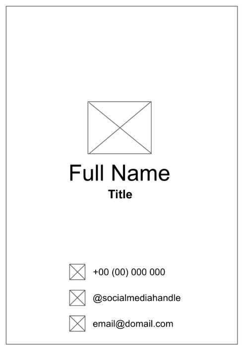
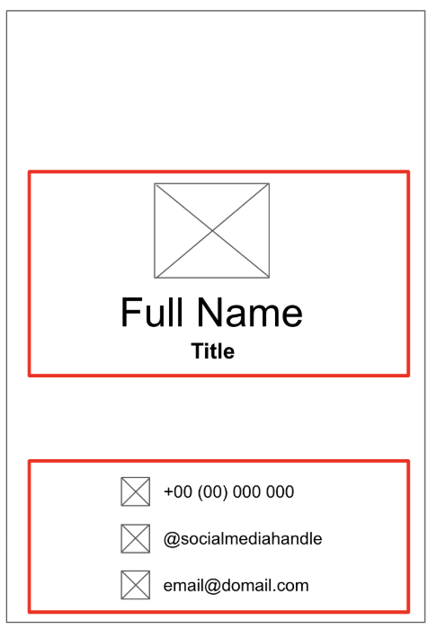
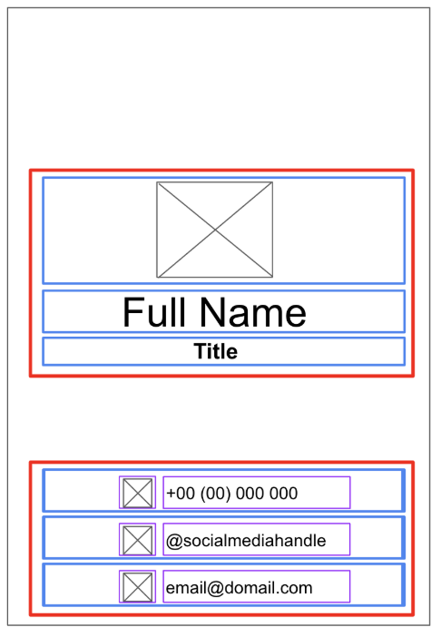

# In-Class 2: Business Card

## Overview

Using things we've learned such as layouts, Rows/Columns, and the Modifier object, we're going to build an Android app that displays a business card. Our app will include Text and Image composables. I have an Android logo image if you'd like to use it, but you can feel free to use a different image. You are also free to choose other design elements such as the background and font colors. 

Here is my version to get an idea:


## Build UI with Composables
Before diving into coding, we want to visualize what the layout might look like. This could include a mock-up of the app, and possibly even specifications as to how much space needs to be between elements or what colors elements need to be.

You could draw your mock-up with pen-and-paper, or use an app with drawing capabilities. Sometimes I will use Power Point or Google Slides. For this assignment, we're going to just use what the [Android tutorial website](https://developer.android.com/codelabs/basic-android-kotlin-compose-business-card?continue=https%3A%2F%2Fdeveloper.android.com%2Fcourses%2Fpathways%2Fandroid-basics-compose-unit-1-pathway-3%23codelab-https%3A%2F%2Fdeveloper.android.com%2Fcodelabs%2Fbasic-android-kotlin-compose-business-card#1) has made for us already. To start with, here is a first draft of our layout



### Convert Design to Code
Now that we have an idea of what it will look like, we can break the app down into the individual parts we need to make.

1. We want to think in terms of composables and divide the app into sections. This will help us divide the screen into small composables that we combine in a heirarchy.

For example, let's divide the screen into two sections:

- Logo, name, and title
- Contact information

We can create a composable for each section, and then put those into a container like a Row or Column.



2. For each of these sections, we can draw boundaries around the individual elements to see how they are placed in relation to one another.



Some of the composables we may want to condiser:

- Row or Column composables
  - These take parameters such as horizontalArrangement and verticalAlignment
- Image composables
  - We can customize the size by setting the width and height modifiers in the modifier parameter
- Icon composables
  - There are some icons built into the Resource Manager, but there are many more from [Material Design](https://fonts.google.com/icons). We can alter the color by changing the Tint parameter.
- Text composables
  - We can play with the fontSize, textAlign, color, and fontWeight

For spacing and alignmnet, we can 

- Use Modifier arguments such as padding
- Use a Spacer composable in between composables

If we want to change the color, we can use the built in Color, or we can use a custom color with a hex code (the RGB of the color represented in hexadecimal). The green for my app was set using

```
Text("Example", color = Color("0xFF3ddc84))
```