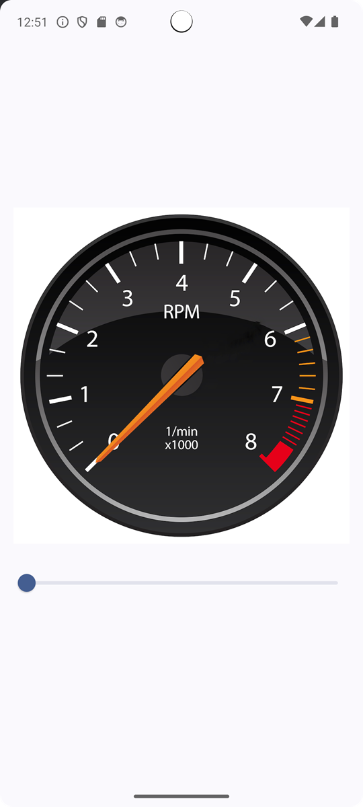

# In-Class 3: RPM Dial and Needle
## Overview
We'll be making an app with a slider that moves the needle of a RPM dial. Your app will look like this:



## App Layout
The basic structure of your code should look like this:

```
@Composable
fun RPMSliderApp(modifier: Modifier = Modifier) {
    // calls to RPMSlider and DialWithNeedle go here
}

@Composable
fun RPMSlider(
    /* parameters? */
    modifier: Modifier = Modifier
) {
    // the slider code will go here
}

@Composable
fun DialWithNeedle(
    /* parameters? */
    modifier: Modifier = Modifier) {
    // show the dial and needle in here
}
```

You will call RPMSlider app from `onCreate`, and also call it from a `@Preview` function.

The first task I would focus on is just getting the Dial and Needle to show up, and then focus on adding the Slider.

## App Components

For the most part, I'm going to let you figure out what you will need for the app. Feel free to search online for how to add a slider and how to rotate things. Because you will need to add a slider and rotate things.

Zip your entire Android Studio project and upload it to the Dropbox.