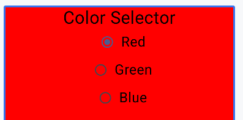
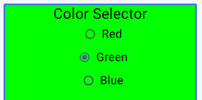
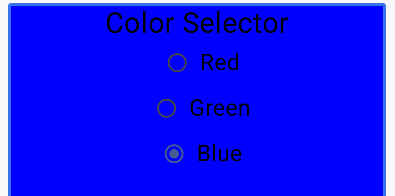
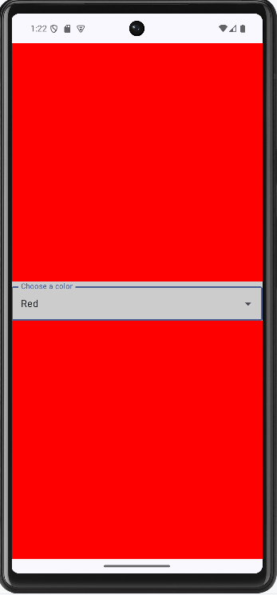
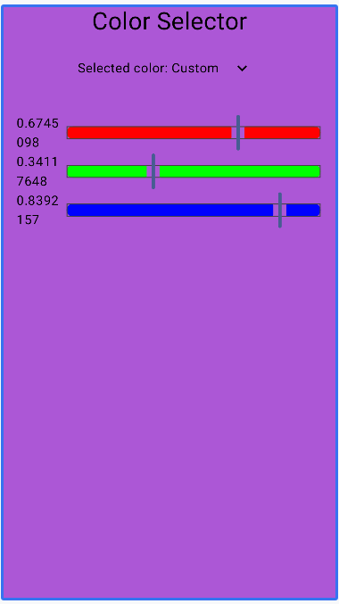

# 🎨 In-Class Exercise – Color Selector

## Overview
We’ll build a simple Jetpack Compose app in two parts:
1. **Preset Color Selector** – choose between Red, Green, and Blue (radio buttons first, then dropdown).  
2. **RGB Sliders** – adjust color channels manually.  

This exercise demonstrates how Compose reacts (or doesn’t!) when you mutate vs. replace state objects.

---

## 🟥 Part 1 – Preset Color Selector

### Step 1 – Model
Create a `data class` that stores a color name and its `Color`.

We can do this in `MainActivity.kt` to make things easier.  

Start with **mutable** properties (`var`) to see what happens.

```kotlin
data class ColorChoice(var name: String, var color: Color)
```

**Helper Functions**

```kotlin
fun colorFromString(colorStr: String): Color {
    return when (colorStr) {
        "Red" -> Color.Red
        "Green" -> Color.Green
        "Blue" -> Color.Blue
        else -> Color.Unspecified
    }
}
```

```kotlin
val colorOptions = listOf("Red", "Green", "Blue")
```

### Step 2 – State
Store a `ColorChoice` in state:

```kotlin
val colorState = remember { mutableStateOf(ColorChoice("Red", Color.Red)) }
val color = colorState.value  // just a convenient way to access but not change the current color
```

### Step 3 – UI
Use **radio buttons** for Red, Green, and Blue.

We can loop through our `colorOptions` list, and it will make a radio button for each one.

Each radio button should:
- Update the `color.name` and `color.color` values when clicked
- Reflect which color is currently selected

> Run it — the background **won’t update** yet.

### Step 4 – Fix
Add a helper method:

```kotlin
fun withColor(newName: String, newColor: Color) : ColorChoice { 
    return ColorChoice(name = newName, color = newColor)
}
```

And/or make a method that just takes a `String` and calls `colorFromString` to get the correct color.

```kotlin
fun withString(newName: String): ColorChoice {
    return withCoor(newName = newName, newColor = colorFromString(newName))
}
```

Update your radio button click handler:

```kotlin
colorState.value = color.withColor(option.name, option.color) // or withString()
```

> ✅ The color now updates immediately.

**It's**  
  
**Pretty**  
  
**Pretty**  
  
**Good**

_But there's still some issues..._

---

### Step 5 – Optional: Replace Radio Buttons with a Dropdown



https://developer.android.com/develop/ui/compose/components/menu

```kotlin
@Composable
fun MinimalDropdownMenu() {
    var expanded by remember { mutableStateOf(false) }
    Box(
        modifier = Modifier
            .padding(16.dp)
    ) {
        IconButton(onClick = { expanded = !expanded }) {
            Icon(Icons.Default.MoreVert, contentDescription = "More options")
        }
        DropdownMenu(
            expanded = expanded,
            onDismissRequest = { expanded = false }
        ) {
            DropdownMenuItem(
                text = { Text("Option 1") },
                onClick = { /* Do something... */ }
            )
            DropdownMenuItem(
                text = { Text("Option 2") },
                onClick = { /* Do something... */ }
            )
        }
    }
}
```

> The dropdown uses the **same update logic**, just a different presentation.

---

## 🟦 Part 2 – RGB Mixer (Adjust Channels)




### Step 1 – Model

We can keep our `ColorChoice` data class. The `Color` class lets us access the RGB channels. We can't just change them though...

```kotlin
fun setColorChannel(channel: String, value: Float) {
    this.color = when (channel) {
        "Red" -> color.copy(red = value)
        "Green" -> color.copy(green = value)
        "Blue" -> color.copy(blue = value)
        else -> color
    }
}
```

Instead of changing `red`, `blue`, or `green`, we need to make a _copy_ of the color, give the copy the updated value for the given channel, and then assign the copy to our `color` member. That will let us actually change the values stored in the ColorChoice. _Is that enough?_

### Step 2 – State & UI

- Use a `Column` with `
- Each slider should change one channel
- The `updateColor` lambda for `ColorSliders` needs to tell the caller **two** things, the `String` of which color slider is being changed, and the `Float` for the updated value of that slider. 

```kotlin
@OptIn(ExperimentalMaterial3Api::class)
@Composable
fun ColorSliders(
    color: Color,
    updateColor: (colorName: String, slider: Float) -> Unit,
    modifier: Modifier = Modifier
)
```

Then call it passing `updateColor` a lambda that calls `setColorChannel`. Since `updateColor` now takes two parameters, we just give the lambda two named parameters.

```kotlin
{ colorName, colorValue ->
    colorState.value.setColorChannel(colorName, newValue)
}
```

That changes `color` _inside_ of our ColorChoice, but the colorState.value is still the same `ColorChoice`. We need to create a brand **new** `ColorChoice`, and **copy** all the things from the _origninal_ into the _new_ one, _except for the things we want to change._

### Step 3 - Copy for Recomposition

There are other side-effects to making `color` a `var` that we won't really get into, but what we want is an **immutable** object, so if we ever want to change a part of it, we must _intentially_ have the state object reference a brand new `ColorChoice`. It turns out, changing the object that we used `remember` on is what triggers **recomposition**. 

We saw inside `colorState.value` that things were in fact changing. We didn't see that on the screen because we kept the same `colorState.value`. Jetpack Compose monitors `colorState.value` and only does recomposition when `colorState.value` references a **different** `ColorChoice`. This sort of makes sense, if the value doesn't change, our app doesn't need to refresh the UI because, well, nothing different or new needs to be drawn.

This diagram sort of shows what's happening. Say we had our `colorState` and `currentColor` set like this:

```kotlin
val colorState = remember { mutableStateOf(ColorChoice("Blue", Color.Blue))}
val currentColor = colorState.value
```  
It would kind of look like in memory:

```kotlin
┌────────────────────────────────────────────┐
│ MutableState<ColorChoice>                  │
│   value ─────────┐                         │
└────────────────────────────────────────────┘
                   │
                   ▼
        ┌──────────────────────────────┐
        │ ColorChoice                  │
        │   name = "Blue"              │
        │   color = Color.Blue         │
        └──────────────────────────────┘
                   ▲
                   │
            currentColor
```

Then if we did this:

```kotlin
currentColor.name = "Red"
currentColor.color = Color.Red
```

It would now look like this:

```kotlin
┌────────────────────────────────────────────┐
│ MutableState<ColorChoice>                  │
│   value ─────────┐                         │
└────────────────────────────────────────────┘
                   │
                   ▼
        ┌──────────────────────────────┐
        │ ColorChoice                  │
        │   name = "Red"               │
        │   color = Color.Red          │
        └──────────────────────────────┘
                   ▲
                   │
            currentColor
```

Jetpack Compose doesn't look into every object to see if any of it's members has changed, that would be too much work. Instead, it checks to see if any of the objects it is watching, which happens when we use `remember` is reassigned. In this situation, `colorState.value` is still assigned to the same object.

To make the previous example work, we need to reassign `colorState.value`. So if we did this:

```kotlin
val currentColor = colorState.value
colorState.value = currentColor.copy(name = "Red", color = Color.Red)
```  
We would end up with this:  
```kotlin
┌────────────────────────────────────────────┐
│ MutableState<ColorChoice>                  │
│   value ───────────────┐                   │
└────────────────────────────────────────────┘
                          │
                          ▼
             ┌──────────────────────────────┐
             │ ColorChoice                  │
             │   name = "Red"               │
             │   color = Color.Blue         │
             └──────────────────────────────┘

currentColor ───────────►  ┌──────────────────────────────┐
                           │ ColorChoice                  │
                           │   name = "Red"               │
                           │   color = Color.Red          │
                           └──────────────────────────────┘
```

So, to change the RGB values stored in `currentColor.color`,  we need to reassign `colorState.value` to a different `ColorChoice` with the updated `Color`. A convention for writing methods that return a copy of the current object **with** updated data is to prefix the function name with, well, `with`. Similarly to how we use `set` with setters, `get` with getters, `with` says, I want this object, but `with` this thing updated.

```kotlin
{ colorName, newValue ->
        colorState.value = color.withUpdatedChannel(colorName, newValue)
}
```

> ✅ Now the background updates in real time.

---

## 🟩 Optional Enhancements
- Add a **DropdownMenu** for preset colors  
  - `var expanded by remember { mutableStateOf(false) }`  
  - `DropdownMenu(expanded = expanded, onDismissRequest = { expanded = false })`
  - Use `DropdownMenuItem` for each color option  
  - When clicked, update with `colorState.value = color.withColor(...)`
- Add a **Text** label showing RGB values
- Add a “Reset” button to restore defaults
- Add a "Save" button to save the current color into the list, either prompting user to name the color, or just give the colors standard names like `Custom1`, `Custom2`, etc.
---

## Summary
- Changing properties inside a state object doesn’t trigger recomposition.  
- Replacing the entire object (`copy()` or helper) does.  
- You can swap UI elements (radio group → dropdown) without changing logic.  
- This pattern will reappear in **Project 2’s Character Creator**.

---

## Turn-in

Zip your entire Android Studio project and upload it to the Pilot Dropbox.