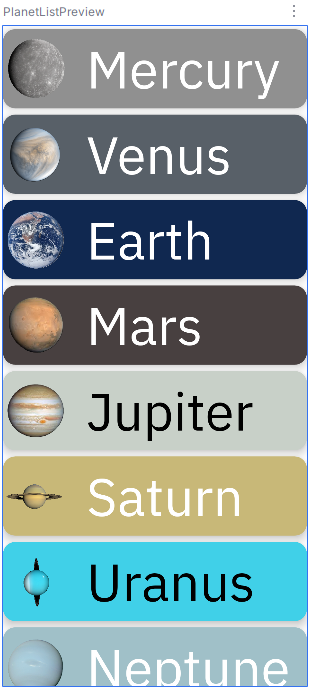
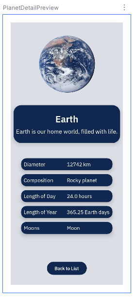
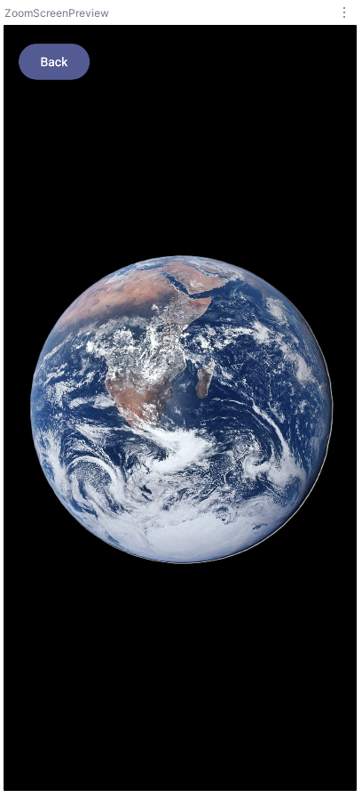

# In-Class 6 - Planet Explorer

In this exercise, you'll build a small multi-screen app that lets the user explore the planets of our solar system. The app includes:

- `PlanetListScreen` showing all the planets


- `PlanetDetailScreen` showing one planet's information  


- `PlanetZoomScreen` where the user can pinch-to-zoom the planet's image  



Your task is to connect the screens using Jetpack Compose Navigation and implement all the required navigation callbacks.

You are provided with:  
- The planet data model
- A list of planet objects
- Fully implemented UI layouts for all three scenes
- Color extraction and styling helpers
- Placeholder callback parameters in each screen

Your job is to build the navigation layer that ties everything together

---

## App Flow (what your navigation should support)

1. **`PlanetListScreen` -> `PlanetDetailScreen`**  
When the user taps on a planet card:  
    - The app should navigate to the `PlanetDetailScreen`
    - The correct planet ID should be passed along (I've given you `currentPlanetId` for that)
    - `PlanetDetailScreen` must show the correct planet (which it should if you correctly update pass `currentPlanetId`)  
2. **`PlanetDetailScreen` -> `PlanetZoomScreen`**  
When the user taps the planet image:
    - Nagivate to the `PlanetZoomScreen`
    - Pass the same `currentPlanetId`
    - Allow the user to zoom in/out of the image (this should already work, but it should still work when you navigate to it)  
3. **Back Navigation**  
Your app should support:
    - Pressing a back button
    - Swiping from the left edge to go back (that is already in the `Detail` and `Zoom` screen, you just need to handle the event)
    - Returning to the correct previous screen (`navController.popBackStack()` maybe?)

If you're like me and like visuals to help understand things, this diagram might help:

    ┌──────────────────────────┐
    │      Planet List         │
    │  (all planets shown)     │
    └──────────────┬───────────┘
                   │
                   │ tap a planet card (passes planetId)
                   ▼
    ┌──────────────────────────┐
    │     Planet Detail        │
    │  (info for one planet)   │
    │                          │
    │  - Tap image → Zoom      │
    │  - Back button → List    │
    │  - Swipe from left → List│
    └──────────────┬───────────┘
                   │
                   │ tap planet image
                   ▼
    ┌───────────────────────────┐
    │      Planet Zoom          │
    │ (pinch & drag to zoom)    │
    │                           │
    │ - Back → Detail           │
    │ - Swipe from left → Detail│
    └───────────────────────────┘

---

## Files You Will Modify  
You should review and modify these files:

### **`MainActivity.kt`**
- Add an enum class (the one below works pretty well)
- Add the `NavHostController`
- Build the `NavHost`
- Define routes for `List` -> `Detail` -> `Zoom`
- Provide callbacks for each screen  

```kotlin
enum class PlanetScreen(@StringRes val title: Int) {
    List(title = R.string.app_name),
    Detail(title = R.string.planet_details),
    Zoom(title = R.string.zoom)
}
```

### `PlanetListScreen.kt`
- Pass in lambdas to handle clicking on a planet entry. You will want to be able to pass something (Int maybe?) so the lambda can update which planet ID was selected
- Handle the click on a planet entry

### `PlanetDetailScreen.kt`  
- Handle:
    - **Back** button
    - **Swipe-back** gesture 
    - **Planet image tap -> Zoom screen**

### `PlanetZoomScreen.kt`
- Handle swipe-back and back button using callback(s) (both will do the same thing, so...)

---

## Implementation
You will implement:
- Creation of a `NavHostController`
- A `NavHost` with three composable destinations
- Navigation from **List** -> **Detail** with planet ID
- Navigation from **Detail** -> **Zoom** with the same ID
- Back navigation using `popBackStack()`
- Handling callback lambdas in the screen composables

Where you see placeholders like:

```kotlin
onPlanetEntryClicked = { /* TODO */ }
onBackClicked = { /* TODO */ }
onPlanetImageClicked = { /* TODO */ }
onSwipeBack = { /* TODO */ }
```

...it is  your job to complete the logic through Navigation

---

## Navigation Graph Diagram
This nifty graph might help you to think about what the inside of your `NavHost` will look like  

                         NavHost
    ───────────────────────────────────────────────────
    │
    │   startDestination = "List"
    │
    │
    ├── "List"
    │       • No arguments
    │       • Shows all planets
    │       • onPlanetEntryClicked(planetId) 
    │             → navigate("detail/{planetId}")
    │
    │
    ├── "Detail"
    │       • Requires planetId (Int)
    │       • Shows planet info
    │       • onPlanetImageClicked()
    │             → navigate("zoom/{planetId}")
    │       • onBackClicked() or swipe
    │             → popBackStack("list", inclusive = false)
    │
    │
    └── "Zoom"
            • Requires planetId (Int)
            • Shows zoomable image
            • onBackClicked() or swipe
                → popBackStack()

---

## Grading and Turn-in

Zip your finished project directory and upload it to the Dropbox for the assignment. This assignment is worth 10 points.