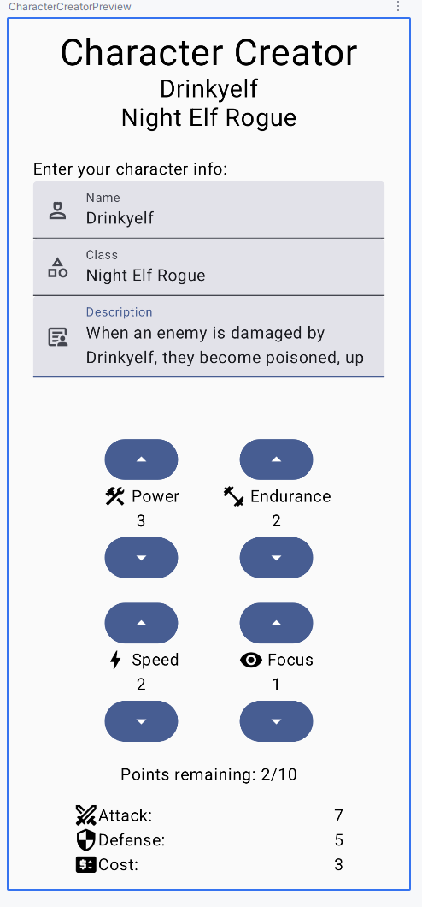

# Project 2 – Character Creator (Data Input)

## Overview

In **Project 2**, you’ll build an input screen that collects all the information for a single **Character Card**.  
You’ll enter text fields for the character’s identity, distribute a limited number of points among four stats, and view the derived card values (`Attack`, `Defense`, `Cost`) update automatically.


This project focuses on **user input and reactive UI updates** — no ViewModel yet. (What did he say about a ViewModel???)  
Project 3 will introduce a ViewModel for state management, and Project 4 will add multiple screens and navigation.

> **Starter code is provided** in the course GitHub repository.  
> You’ll be responsible for connecting the provided data model (`Character.kt`) to your UI, implementing composables, and managing state through callbacks.

---

## Starter Code

The repository includes:

- **`Character.kt`** – Contains the `Character` data class, helper functions, and stat logic.  
  This file handles all data updates, point calculations, and attribute formulas.  
  **You do not need to modify this file.**

- **`MainActivity.kt`** – Contains composable function stubs and TODO comments.  
  You will complete this file by building the Compose UI and wiring up user interactions.

---

## `Character` Class

The `Character` class represents all data for this project. It is **immutable**, meaning you don't directly modify it's fields. Instead, you create updated copies when something changes.

### Accessing the Storing State

Use the provided helper to create a state that triggers recomposition:

```
// these are given for you in the CharacterCreatorApp composable
val characterState = rememberCharacterState()
val character = characterState.value
```

### Updating Fields

To update a property like the name, create a copy:

```
characterState.value = character.copy(name = "New Name")
```

### Updating Stats

Use the provided helper function:

```
// updateStat takes the state, the stat name, a delta (+/-1) and the maximum number of points
updateStat(characterState, "Power", +1, character.maxPoints)
updateStat(characterState, "Focus", -1, character.maxPoints)
```

These automatically handle:
- Staying within the max points limit
- Recalculating attributes (Attack, Defense, Cost)

### Reading Derived Values

Attributes are updated automtically when stats change:

```
val attack = character.attributes["Attack"]
val defense = character.attributes["Defense"]
val cost = character.attributes["Cost"]
```

---

## Character Information

At the top of the screen, include:

- **Name** – `TextField`
- **Class / Type** – `TextField` (or `DropdownMenu` or `RadioButtons`)
- **Description** – multi-line `TextField`

These values should update the `Character` object reactively as the user types.

---

## Stat Allocation

Below the text inputs, add four stats the user can adjust using **up / down buttons**:  
**Power**, **Endurance**, **Speed**, and **Focus**.

The player begins with **10 total points** they can spend to create their Character.  
Each “▲” button adds 1 point (if points remain); each “▼” removes 1 point (if > 0).  
When the pool is empty, increase buttons should disable or have no effect.

| Stat | Represents | Affects |
|:--|:--|:--|
| Power | Raw offense | Increases Attack |
| Endurance | Durability | Increases Defense |
| Speed | Agility | Adds a small bonus to both Attack and Defense |
| Focus | Precision / Magic | Reduces overall Cost slightly |

The stats and their icons are defined for you in `Character.kt`.

---

## Derived Values

The derived card values should update **live** as the user adjusts stats.

```
Attack:   7
Defense:  5
Cost:     3
```

These are computed automatically in the `Character` class using:

```kotlin
attack   = (2 * power + 0.5 * speed).toInt()
defense  = (2 * endurance + 0.5 * speed).toInt()
cost     = ((attack + defense) / 4.0 + 0.5 * focus).toInt()
```

Your job is to **display** them on screen beneath the stat area.

---

## Project Goals

Your implementation should demonstrate:

- Correct use of `remember` and mutable state (this is done for you in the Character class)
- State hoisting via callbacks (e.g., `onNameChange`)
- Reusable composables for input fields and stat buttons
- Proper layout and spacing with `Column`, `Row`, and `LazyVerticalGrid`
- Live UI updates as the character data changes

---

## Example Screenshot



You do not need all the Icons or text labels in each `TextField`. You can play around with colors, fonts, button shapes, or any visual aspect. One way to do this is with the [Material Theme Builder](https://material-foundation.github.io/material-theme-builder/) which will give you files you can use in your project. I find just playing around with those things helps me learn how to actually do things, because I usually need to look it up and follow examples.

If you _want_ to add things like an `Icon` for each element, I've included the ones I used plus several more in the Android Studio project. You are free to browse and use any others you may find.

It is not necessary, but you can use String resources, or for this assignment you may just hard-code most things. However, you will need to think ahead as this app will end up just being integrated as one part of a larger app.

---

## Submission

Take a screenshot showing both the input fields and stat area with derived values visible.  
Zip your entire Android Studio project + screenshot and upload it to Dropbox.

---

## Grading (25 pts)

| Task | Pts |
|:--|:-:|
| Text fields for name, class/type, description | 4 |
| Four stat controls with increment/decrement buttons | 6 |
| Total points capped at 10 and non-negative | 4 |
| Displays remaining points accurately | 3 |
| Derived Attack, Defense, Cost values update live | 4 |
| Clean, organized layout (Columns/Rows/Spacing) | 4 |

---

## Next Steps

If you want to think ahead, these are what we have for the last two projects:

- **Project 3:** Move all state variables into a `CharacterViewModel`.
- **Project 4:** Add navigation between a *Character List* and a *Character Editor*, displaying the finished card on a final screen.

You can also review your CharacterCard if you'd like, we will integrate the card into Project 4, and all of the text, image, and possibly other elements will need to be input to the card. But we will also look at that in class.
