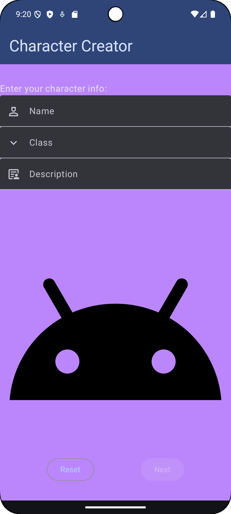
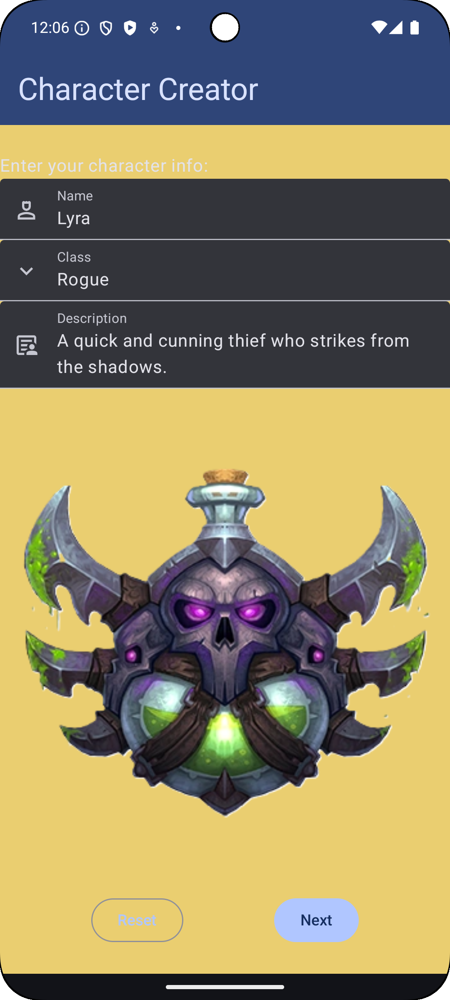
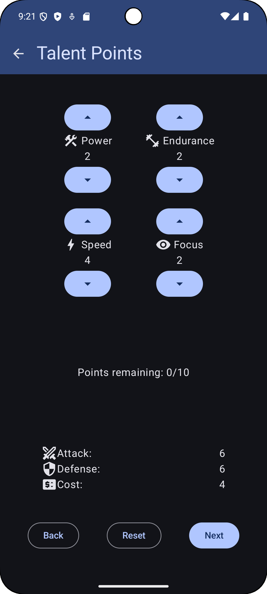
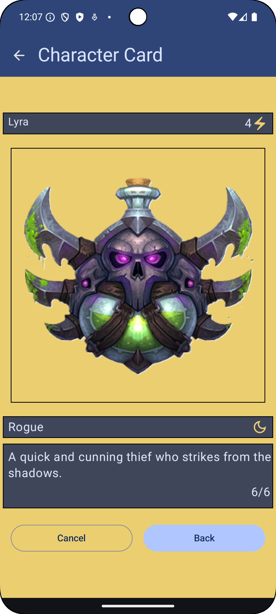

# Project 4 - Character Creator Deluxe

## Overview

In this project, you'll combine **Project 1** (**Character Card**), with the 
**Character Creator** app from Projects 2 and 3 to create a complete, multi-screen experience.

The user will:

1. Enter basic character details (name, class, description, image)
2. Spend the talent points to customize stats
3. View the final **Character Card** displaying all the chosen information and calculated attributes

You'll also implement **navigation** between these screens using Jetpack Compose's navigation components.

---

## Getting Started

You may start from a **new blank Android Studio Empty Activity**. 

Create three Kotlin files (extension `.kt`) and use `MainActivity.kt` for the navigation logic.  
Each file should contain a composable for its screen and a `@Preview` to help y ou design the layout before wiring up the navigation.

Add simple buttons for `Next`, `Back`, and optionally `Reset` on each screen.  
These will use **callback functions** passed from `MainActivity` to handle navigation events and data reset.

### Starter Code

You may work off your Project 3 solution, however I have provided a skeleton, similar to the Planet Explorer app, that you may use in whatever way you wish to implement Project 4.  
There are image resources, color resources, string resources, extended Character and CharacterCreatorUiState, Kotlin files for each starter screen with example composables for each screen, and a MainActivity with the basic structure.

The files of interest, with comments to guide you, are:

- `MainActivity.kt`
- `ClassSelectionScreen.kt`
- `TalentPointScreen.kt`
- `CharacterCardScreen.kt`
- `CharacterViewModel.kt`
- `TextEntry.kt`
  
The other files are mostly unchanged from Project 3. However, there are some additions to a few that may be worth checking out. 

- `DataSource.kt`  
  - `dummyChar`  can be passed from your `@Preview` just so you have something to pass and test the layout.  
  - `dummyUiState` is similar, where it has `dummyChar` as the `currentCharacter`
  
- `Character.kt`
  - I recommend keeping the image, icon, and whatever resource associated with a character inside the Character class. 
  
    I added four fields to do that.
    - `@ColorRes val characterColor: Int? = null`
    - `@DrawableRes val characterImage: Int? = null`
    - `@DrawableRes val characterIcon: Int? = null`
    - `@DrawableRes val classIcon: Int? = null`
  - Because those are nullable (can be `null`), before you access the value you need to check for `null`. At the same time, you can tell your app what to do if the variable is null. 
    
    For example, if you want to get the `characterImage` you could say 
   
    `val cardImageId = character.characterImage ?: R.drawable.ic_launcher_foreground`  

    Which will get the image ID if it isn't null, otherwise it will use the Android logo as a placeholder so your program doesn't crash.

- `CharacterCreatorUiState.kt`
  - Now that we have a few more things to track, I added, along with the `currentCharacter` we already had
    - `selectedClass` which is simply, "Warror," "Rogue," etc. This field is set when a class is selected from the dropdown menu.
    - `isCustom` flags whether the user is creating a custom character, which is mostly used to control whether the user can type in the `TextField` for `charClass`
    - `isDefault` flags whether the current selected class is in `defaultCharacters`. The meaning of this field is subtle, it's mostly used when the app first starts as in my version, the user hasn't selected a **default** or **custom** class from the dropdown. If you don't want to allow the user to type in a class, this, along with `isCustom` are probably not needed.
    - arePoints
  
---

## Screen 1: Character Creator (Text & Image)

The first screen allows the user to input:

- Character **name**
- Character **class**
- **Description**

For the class selection, reuse your dropdown (or try an alternative like a [scrollable list](https://developer.android.com/develop/ui/compose/touch-input/pointer-input/scroll)). The class chosen chould automatically determine the associated **character image**

If you prefer, you can implement a separate image selector, but simply linking the image to the selected class is fine.

> Gaal: Display input fields and the image of the selected class/character before moving to the next screen

---

## Screen 2: Spend Talent Points

This screen lets the user **allocate points** to the character's stats, similar to Project 3.  
Use your existing `Button` controls to increment and decrement the stats, and continue to enforce the `maxPoints` constraint. 

If you want, you may also preview the attributes on this screen, but you may also keep them hidden for the next screen...

> Goal: Implement working stat adjustment logic with a visible remaining-points counter

---

## Screen 3: Character Card

The final screen displays a complete **Character Card** built from all the user's inputs.  
You can reuse your Project 1 layout or redesign it with the same elements:

- Character name and class
- Description
- `attack/defense` (or other computed values) derived from stats
- (Optional) Class-specific colors and icons

For example, you might use the class color as the card background and place the class icon opposite the class name. In the screenshot of my implementation, I had yellow as the color for Rogue and the moon as the Rogue's class icon.

> Goal: Show all chosen character data and computed stats in a polished card format

---

## Navigation

You'll use `NavHost` and `NavController` for screen navigation, just like in the **Cupcake app** example

If you need a fresher, follow this [Compose Navigation Codelab](https://developer.android.com/codelabs/basic-android-kotlin-compose-navigation?continue=https%3A%2F%2Fdeveloper.android.com%2Fcourses%2Fpathways%2Fandroid-basics-compose-unit-4-pathway-2%23codelab-https%3A%2F%2Fdeveloper.android.com%2Fcodelabs%2Fbasic-android-kotlin-compose-navigation#2).  
Implement routes for all three screens and handle transitions such as :

- `Creator -> TalentPoints -> Card`
- `Back` or `Reset` to return to the previous screens

---

## Grading

Zip your entire Android studio project folder and upload it to the corresponding Dropbox in Pilot
for this assignment. You **must** implement the app using **Jetpack Compose**, otherwise you will
receive zero credit. This project is worth **25** points, distributed as follows:

| Task                                                                                  | Points |
|---------------------------------------------------------------------------------------|--------|
| Screen 1 - Select a pre-made character                                                | 6      |
| Screen 2 - Spend talent points, works the same as in Project 3                        | 6      |
| Screen 3 - Show Character Card with fields based on chosen character and spent points | 6      |
| Can navigate from 1 -> 2 -> 3, also cancel/back                                       | 6      |
| Just for working on this project, you get 1 point!                                    | 1      |
| **Total**                                                                             | **25** |